# AI Operations Research Hub

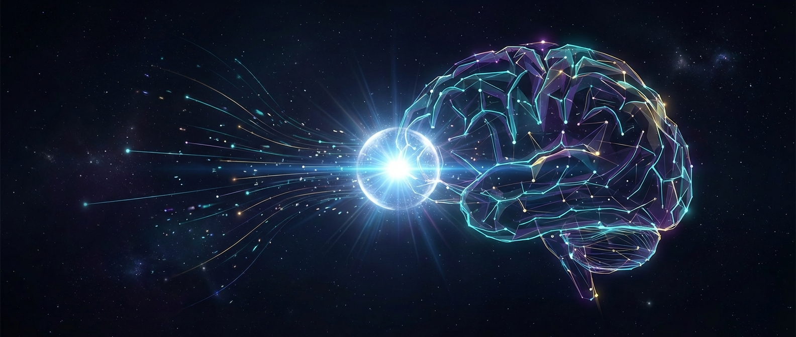

> **The Definitive Knowledge Base for AI Operations**
> *Building the operating layer for human-AI collaboration*

**Last Updated**: 2026-02-03 | **Status**: Active Research | **Version**: 3.0

---

## 2026 AI Model Landscape

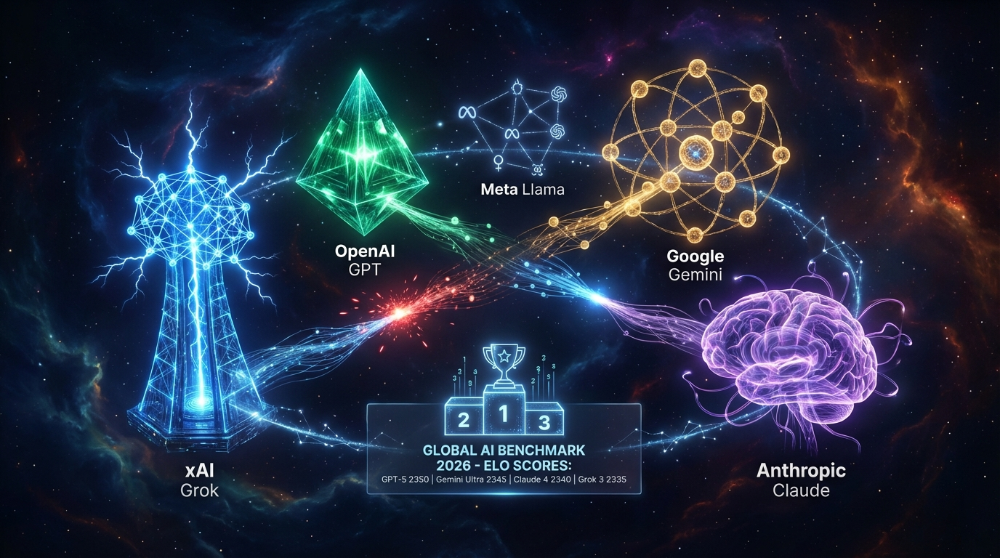

### Frontier Models (February 2026)

| Model | Organization | Key Achievement |
|-------|--------------|-----------------|
| **Grok 4.1** | xAI | #1 LMArena (1483 Elo), 65% hallucination reduction |
| **GPT-5.2 Pro** | OpenAI | First 90% ARC-AGI, 390x cost reduction |
| **Gemini 3 Pro** | Google | Best multimodal (81% MMMU-Pro) |
| **Claude Opus 4.5** | Anthropic | Best coding (80.9% SWE-bench) |
| **Llama 4 Maverick** | Meta | Open-weight MoE (400B/17B active) |

[**Full Model Guide →**](./AI_MODELS_2026_STATE_OF_THE_ART.md)

### Mixture of Experts (MoE) Architecture

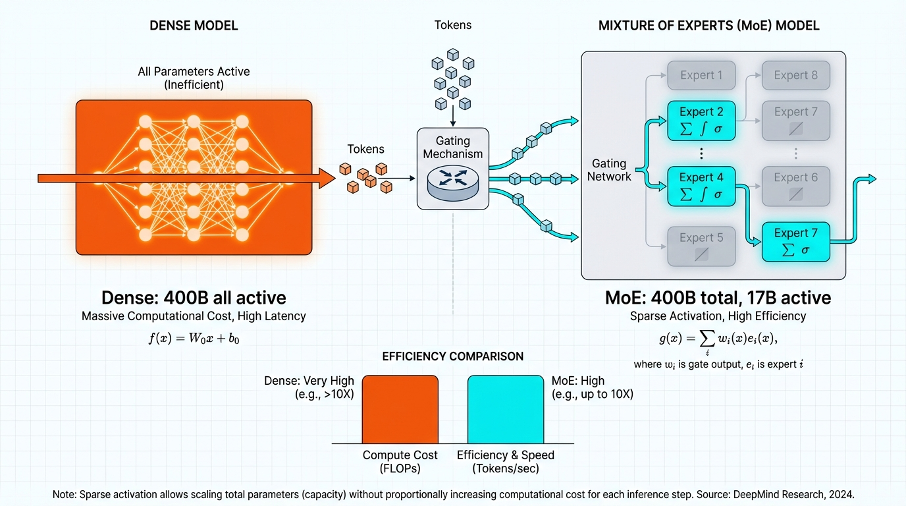

MoE is revolutionizing AI efficiency:
- **Llama 4 Maverick**: 400B total params, only 17B active per token
- **10M context** on Llama 4 Scout
- Runs on single H100 GPU with quantization

---

## What is AI Ops?

**AI Ops is not DevOps for AI.** It's how humans and AI operate together—across personal life, creative work, family, and enterprise. This research hub contains mastery-level documentation covering architecture, implementation, academic papers, and the path to AGI.

### The 2026 Landscape

| Metric | Value | Source |
|--------|-------|--------|
| Global AI Capex | **$571B** (2026) → $1.3T (2030) | UBS |
| Enterprise Agent Adoption | **40%** by end of 2026 | Gartner |
| Memory Accuracy Boost | **+26%** with Mem0 | arXiv:2504.19413 |
| Token Savings | **90%** reduction | Mem0 Research |
| Agent Task Duration | **Doubling every 7 months** | METR Research |

---

## Visual Architecture

### The 5-Layer AI Ops Stack


The AI Ops stack organizes operations into five distinct layers, each with specialized tools and responsibilities:

| Layer | Function | Key Tools |
|-------|----------|-----------|
| **5. Interface** | User interaction | Open WebUI, LibreChat, Custom Apps |
| **4. Orchestration** | Agent coordination | LangGraph, CrewAI, AutoGen |
| **3. Memory** | Knowledge persistence | Mem0, Graphiti, Qdrant |
| **2. Observability** | Monitoring & traces | Langfuse, LangSmith, Arize |
| **1. Gateway** | Unified API routing | LiteLLM, Portkey, Martian |

### Unified Gateway Architecture

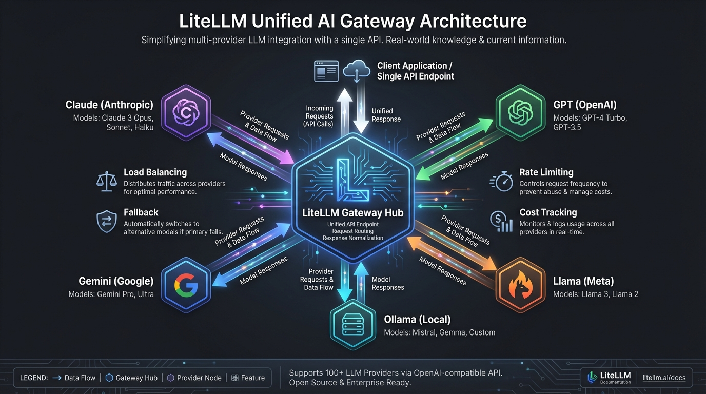

### Multi-Agent Orchestration

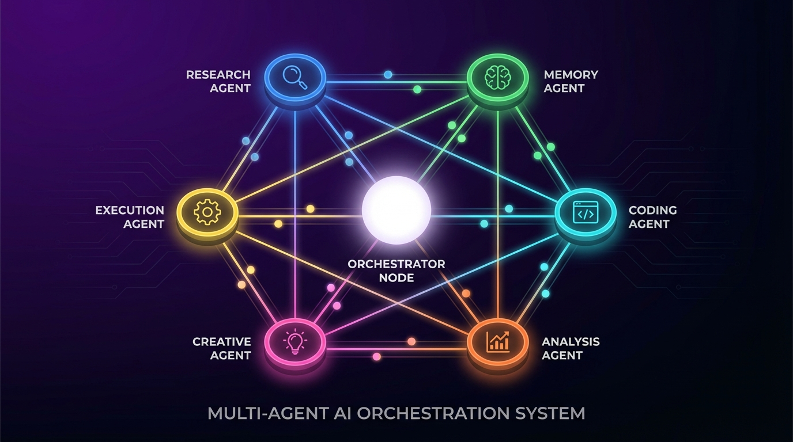

---

## Memory Systems

### The Memory Hierarchy

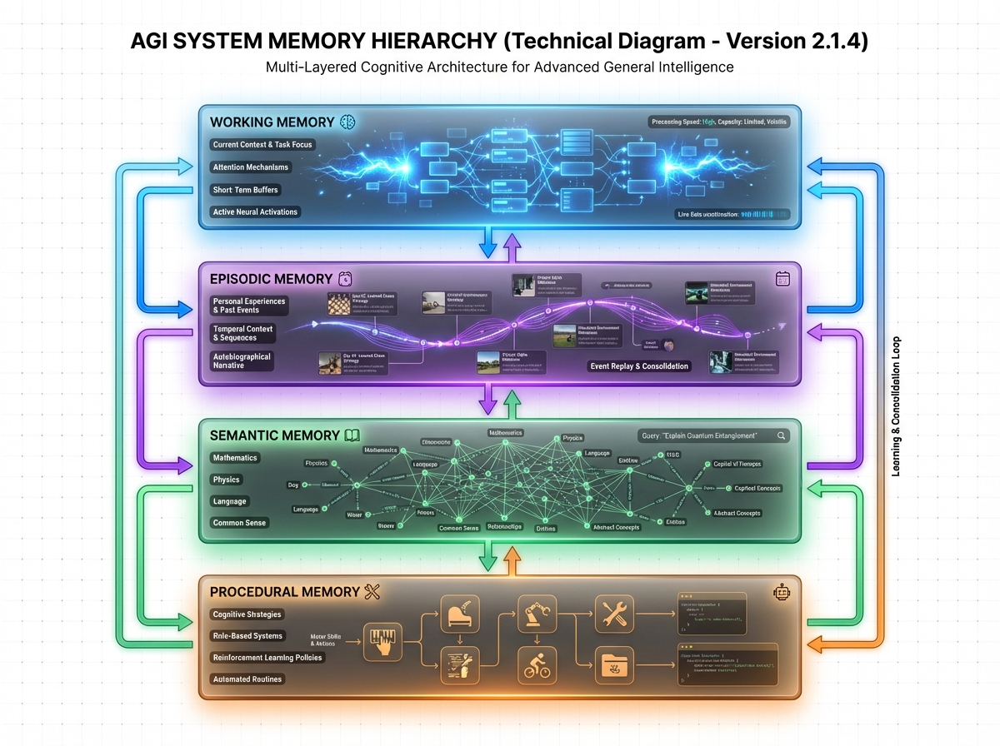

AGI-ready systems require four distinct memory layers:

| Layer | Purpose | Retention | Access Speed |
|-------|---------|-----------|--------------|
| **Working** | Active task context | Seconds-minutes | O(1) |
| **Episodic** | Specific experiences | Days-months | O(log n) |
| **Semantic** | General knowledge | Permanent | O(log n) |
| **Procedural** | Skills & methods | Permanent | O(1) |

### Temporal Knowledge Graphs

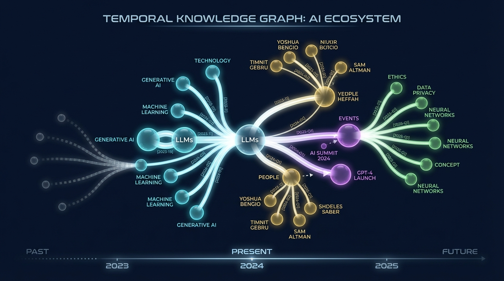

---

## Maturity Model

### The 6-Level Journey

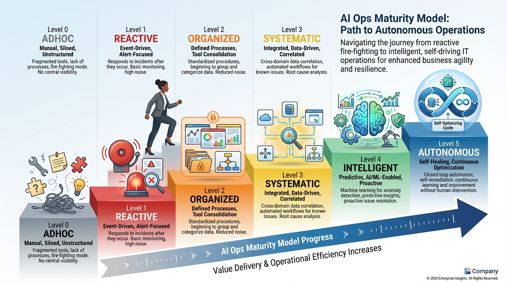

| Level | Name | Characteristics |
|-------|------|-----------------|
| **0** | Ad-hoc | No system, random tool usage |
| **1** | Reactive | Basic tools, no tracking |
| **2** | Organized | Consolidated interfaces |
| **3** | Systematic | Observability, documented workflows |
| **4** | Intelligent | Agents, memory systems, automation |
| **5** | Autonomous | Self-improving, human-in-the-loop only |

---

## Observability

### AI Ops Observatory


Key metrics to track:
- **Token usage** per model, per day, per workflow
- **Cost breakdown** by provider and task type
- **Latency percentiles** (P50, P95, P99)
- **Trace waterfall** for debugging complex chains

---

## The Path to AGI

### Emergence Timeline

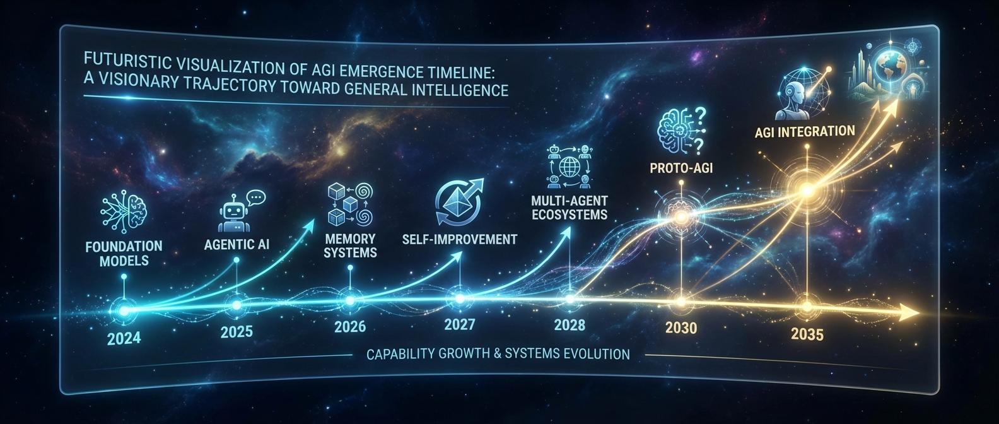

| Year | Milestone | Key Capability |
|------|-----------|----------------|
| 2024 | Foundation Models | GPT-4, Claude 3, Gemini |
| 2025 | Agentic AI | Tool use, reasoning chains |
| 2026 | Memory Systems | Persistent context, learning |
| 2027 | Self-Improvement | Automated optimization |
| 2028 | Multi-Agent Ecosystems | Coordinated intelligence |
| 2030 | Proto-AGI | Domain-general reasoning |
| 2035 | AGI Integration | Full autonomy |

---

## Knowledge Base Contents

### Core Documents

| Document | Description | Read Time |
|----------|-------------|-----------|
| [Master Architecture](./AI_OPS_MASTER_ARCHITECTURE.md) | Complete 5-layer stack, 4 reference architectures | 45 min |
| [Knowledge Graph](./AI_OPS_KNOWLEDGE_GRAPH.md) | JSON-LD schema for AI/AGI consumption | 30 min |
| [Implementation Patterns](./AI_OPS_IMPLEMENTATION_PATTERNS.md) | 6 patterns with production Python | 60 min |
| [Maturity Model](./AI_OPS_MATURITY_MODEL.md) | Assessment framework, transition guides | 40 min |
| [Future Vision](./AI_OPS_FUTURE_VISION.md) | 2026-2035 roadmap, AGI integration | 35 min |
| [AGI-Ready Systems](./AGI_READY_KNOWLEDGE_SYSTEMS.md) | Memory hierarchies, self-improvement | 30 min |

### Research & Reference

| Document | Description | Read Time |
|----------|-------------|-----------|
| [**AI Models 2026**](./AI_MODELS_2026_STATE_OF_THE_ART.md) | Grok 4, GPT-5.2, Gemini 3, Claude Opus 4.5, Llama 4 MoE | 30 min |
| [Research Papers](./PAPERS.md) | 40+ curated academic papers | Reference |
| [Glossary](./AI_OPS_GLOSSARY.md) | 100+ terms with semantic markup | Reference |
| [GitHub Repos](./GITHUB_REPOS_ESSENTIAL.md) | Essential repositories by tier | 15 min |
| [Deep Research 2026](./AI_OPS_DEEP_RESEARCH_2026.md) | Industry synthesis | 25 min |

---

## Featured Research Papers

### Memory Systems (2025-2026)

| Paper | Key Finding |
|-------|-------------|
| [Memory in the Age of AI Agents](https://arxiv.org/abs/2512.13564) | New taxonomy beyond long/short-term |
| [A-MEM: Agentic Memory](https://arxiv.org/abs/2502.12110) | Zettelkasten-inspired knowledge networks |
| [Mem0 Production Systems](https://arxiv.org/abs/2504.19413) | 26% accuracy boost, 90% token savings |
| [Graphiti Temporal Graphs](https://arxiv.org/abs/2501.13956) | Episode → Entity → Relationship layers |

### From Top AI Labs

| Lab | Focus | Notable Work |
|-----|-------|--------------|
| **Anthropic** | Safety & alignment | Constitutional AI, Model Spec, Sleeper Agents |
| **OpenAI** | Capabilities | o1/o3 reasoning, GPT-4 system |
| **DeepMind** | World models | Genie 3, AlphaFold 3, Gemini |
| **Meta** | Open source | Llama 4, Purple Llama security |

[View Full Paper Collection →](./PAPERS.md)

---

## Quick Start Paths

### For Individuals
```bash
# 1. Deploy local AI
ollama pull llama3.3:70b

# 2. Add unified interface
docker run -d -p 3000:8080 ghcr.io/open-webui/open-webui:main

# 3. Point to LiteLLM (optional)
# See: AI_OPS_IMPLEMENTATION_PATTERNS.md
```

### For Creators
1. Read [Creator Architecture](./AI_OPS_MASTER_ARCHITECTURE.md#creator-reference-architecture)
2. Implement [Memory-Augmented Agents](./AI_OPS_IMPLEMENTATION_PATTERNS.md#pattern-3)
3. Build content pipelines with observability

### For Enterprises
1. Assess with [Maturity Model](./AI_OPS_MATURITY_MODEL.md)
2. Deploy [Enterprise Stack](./AI_OPS_MASTER_ARCHITECTURE.md#enterprise-reference-architecture)
3. Implement [Governance Framework](./AI_OPS_FUTURE_VISION.md#governance)

---

## Sources & Citations

### Primary Research
- [Anthropic Research](https://www.anthropic.com/research)
- [DeepMind Publications](https://deepmind.google/research/publications/)
- [OpenAI Research](https://openai.com/research/)
- [arXiv AI Papers](https://arxiv.org/list/cs.AI/recent)

### Industry Analysis
- [a16z Big Ideas 2026](https://a16z.com/newsletter/big-ideas-2026-part-1/)
- [O'Reilly Signals 2026](https://www.oreilly.com/radar/signals-for-2026/)
- [MIT Technology Review](https://www.technologyreview.com/2026/01/12/1130003/mechanistic-interpretability-ai-research-models-2026-breakthrough-technologies/)
- [Stanford HAI AI Index](https://hai.stanford.edu/ai-index)

### Technical Resources
- [LiteLLM Documentation](https://docs.litellm.ai/)
- [Langfuse Documentation](https://langfuse.com/)
- [LangGraph Documentation](https://langchain-ai.github.io/langgraph/)
- [Mem0 Documentation](https://docs.mem0.ai/)

---

## Visual Gallery

| Image | Description |
|-------|-------------|
|  | Research hub hero banner |
| 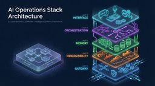 | 5-layer architecture |
|  | Unified API gateway |
|  | Multi-agent system |
| 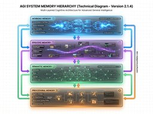 | Memory hierarchy |
|  | Knowledge graph |
| 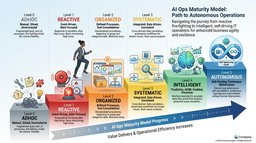 | Maturity model |
| 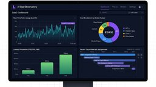 | Observability |
|  | AGI timeline |

---

## About This Research Hub

This knowledge base is designed for:

1. **Human readers** seeking comprehensive AI Ops understanding
2. **AI systems** requiring structured knowledge (JSON-LD, semantic markup)
3. **Future AGI** as foundational context for AI operations
4. **frankx.ai** publication and content strategy

**Maintainer**: FrankX Research Council
**License**: Creative Commons Attribution 4.0
**Repository**: [github.com/frankxai/ai-ops](https://github.com/frankxai/ai-ops)

---

*"AI Ops is not a product. It's a practice. The infrastructure you build today determines the intelligence you can deploy tomorrow."*

---

**Navigation**: [Papers](./PAPERS.md) | [Architecture](./AI_OPS_MASTER_ARCHITECTURE.md) | [Patterns](./AI_OPS_IMPLEMENTATION_PATTERNS.md) | [Maturity](./AI_OPS_MATURITY_MODEL.md) | [Future](./AI_OPS_FUTURE_VISION.md) | [Glossary](./AI_OPS_GLOSSARY.md)
